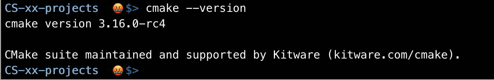

# Mac Instructions</br>

- ### [Installing `git`](#mac_installing_git)</br>
- ### [Installing `cmake`](#mac_installing_cmake)</br>

---

</br>

<a name="mac_installing_git"></a>

## Installing git

</br>

### Install git

We use [homebrew](https://brew.sh/) to [install git](https://git-scm.com/download/mac).

```sh
$ brew install git
```

If you see "brew: command not found", then you need to install brew.

```sh
$ /bin/bash -c "$(curl -fsSL https://raw.githubusercontent.com/Homebrew/install/HEAD/install.sh)"

# The following two lines for Apple M1 Processor

# you can find the following command in terminal
$ echo 'eval "$(/opt/homebrew/bin/brew shellenv)"' >> /Users/YOUR_DEVICE_NAME/.zprofile

$ eval $(/opt/homebrew/bin/brew shellenv)
```

You need to install **Xcode** from App Store before you use other IDE.

</br>

### Check git installation

To make sure git is installed correctly

```sh 
$ git --version
```


</br>

### Login git

Login git with username and email address:

```sh
$ git config --global user.name "stephengineer"
$ git config --global user.email "swang03@pasadena.edu"
```

---

</br>

<a name="mac_installing_cmake"></a>

## Installing cmake

</br>

### Install cmake

We use homebrew to install [cmake](https://cmake.org/):

```sh
$ brew install cmake
```

</br>

### Check cmake version

Let's check to see if `cmake` is installed successfully:

```sh
$ cmake --version
```



</br>

If you do not get a response similar to this, then you do not have `cmake` on your system and you have to install it.

---

Once everything is installed, you can move on to the [next step](start_project.md)