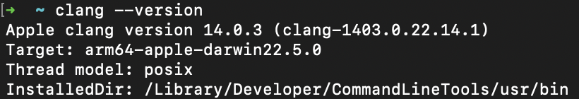
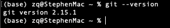

# Mac Instructions</br>

- ### [Installing `Xcode`](#mac_installing_Xcode)</br>
- ### [Installing `CMake`](#mac_installing_cmake)</br>
- ### [Configuring `Git`](#mac_configure_git)</br>

---

</br>


<a name="mac_installing_Xcode"></a>

## Installing Xcode

You need to install **Xcode Command Line Tools** to use **clang** and **git**

### Install Xcode Command Line Tools

To install Xcode Command Line Tools in your terminal, run:
```shell
xcode-select --install
```
Click install and wait until the installation completes

### Check clang installation

Let's make sure clang is installed correctly

```shell
clang --version
```



If you do not get a response similar to this, then you do not have `CMake` on your system.

### Check git installation

To make sure git is installed correctly

```shell
git --version
```




<a name="mac_installing_cmake"></a>

## Installing cmake

### Install cmake

We use homebrew to install [CMake](https://cmake.org/):

```shell
brew install cmake
```

If you see `brew: command not found`, then you need to install brew.

```shell
/bin/bash -c "$(curl -fsSL https://raw.githubusercontent.com/Homebrew/install/HEAD/install.sh)"
```

</br>

### Check CMake version

To check to see if `CMake` is installed successfully:

```shell
cmake --version
```


</br>


<a name="mac_configure_git"></a>

## Configuring git

### Configure git

Configure git with your username and email address:

```shell
git config --global user.name "stephengineer"
git config --global user.email swang03@pasadena.edu
```

### Install GitHub CLI

Installing the CLI

```shell
brew install gh
```

To login to GitHub

```shell
gh auth login
```

The CLI will step you through logging in with your github account

---

### After you have installed:
- **Xcode Command Line Tools**
    - **clang**
    - **git**
- **Cmake**
- **GitHub CLI**

you can move on to the [next step](start_project.md)