# Starting the lab</br>

- ### [Accepting the assignment](#accepting_the_assignment)</br>
- ### [Cloning the assignment](#cloning_the_assignment)</br>
- ### [Project organization](#project_organization)</br>
- ### [Git commands](#git_commands)</br>
- ### [Getting started with the project](#getting_started)</br>
- ### [Completing the project](#completing_the_project)</br>


</br>

<a name="accepting_the_assignment"></a>

## Accepting the assignment

Here is the **assignment link** for [CS3A](https://github.com/CS-PCC/CS3A_Assignments) and here is the link for [CS8](https://github.com/CS-PCC/CS8_Assignments)

</br>

### Accept assignment

1. Click on the assignment link.
1. Select yourself from the list with your name.
1. Click on the green button, `Accept this assignment`  to accept the assignment.

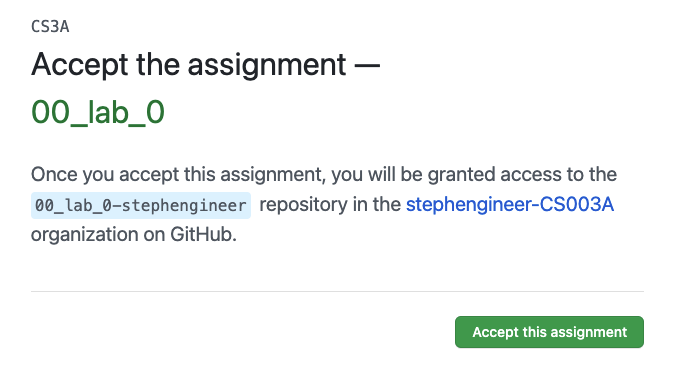

</br>

This will create a repo under your github username. The name of repo will be the name of assignment followed by your github name.

> `00_lab_0-stephengineer`

</br>

### Assignment repo

Once you accepted the assignment, github will begin to create your assignment repo and give it a few seconds, then:

1. Refresh this page to see updates.
1. Click the link of repo.

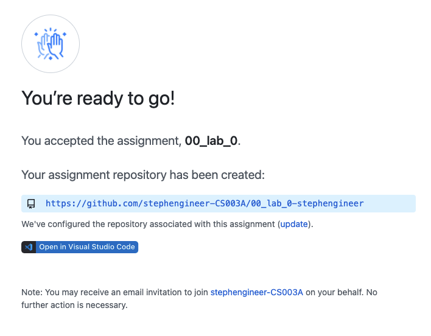

</br>

__Note__: Bookmark this page to know how to get here. We'll need to check in here soon.

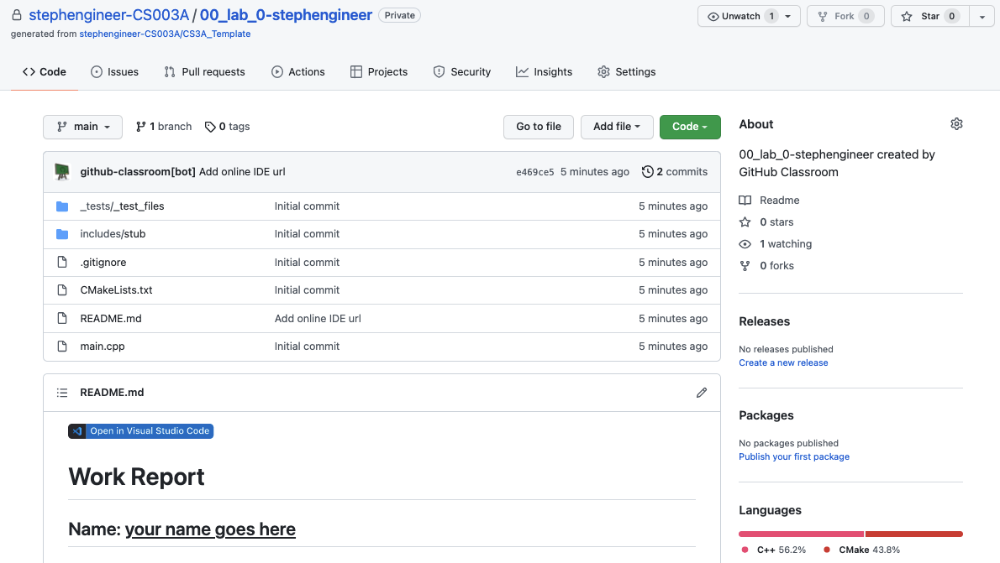

---

</br>

<a name="cloning_the_assignment"></a>

## Cloning the assignment

### Get git link of assignment

1. Click on the green `Code` button on the mid-right.
1. Click the little clipboard and that will copy the link into your clipboard so you can paste it in the next step. 

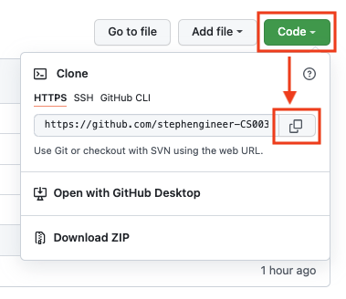

</br>

### Clone assignment

Before you can work on your project, you will need a local copy of the assignment. This is called **clone** the repository.

**Note**: For Windows, do **NOT** clone project under `OneDrive` folder for Windows user.


```sh
# create and go the the directory of projects
$ cd /Users/stephen/CS3A/

# clone repo
$ git clone https://github.com/stephengineer-CS003A/00_lab_0-stephengineer.git
```

---

</br>

<a name="project_organization"></a>

## Project Organization

</br>

### Open assignment with VSCode

Open VSCode and loads the project folder

```sh
# go the project folder
$ cd 00_lab_0-stephengineer

# open VSCode
$ code .

Without using command, you can just double click on the VSCode app to open it.
```

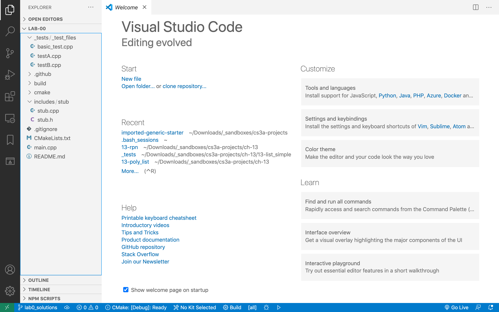

</br>

### File system

All the projects in this class will follow the same file organization.

On the left panel (Explorer) you will find the `main.cpp` on the root folder, and the three most important folders in this directory:

- `_tests`: holds your google test files. The grader will run these files to obtain your score. You will ignore `testA.cpp` for the most part. The bulk of your work will be done in `testB.cpp`.

- `includes`: contains a folder for each of the libraries/classes your project depends on. In this starter code, you only have a `stub` folder that contains `stub.h` and `stub.cpp`. These files are `#include`d in `testB.cpp`

- `build`: is where you go to build and run your project. This is where all your compiled and executable files will end up.

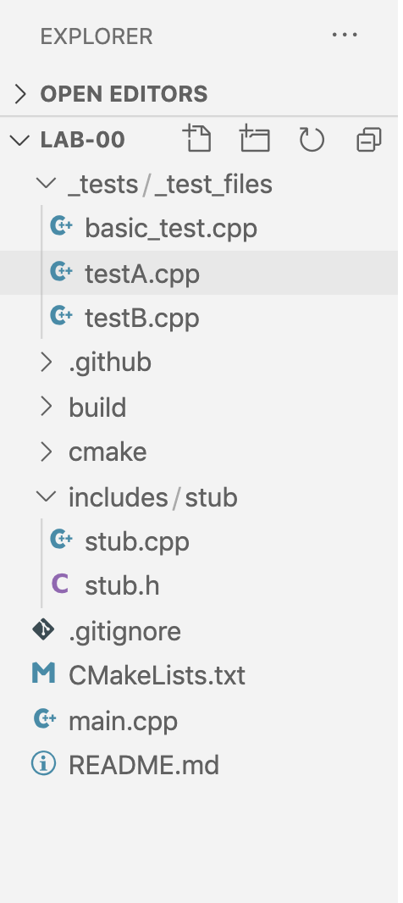

</br>

### Test files

#### basic_test.cpp: Prof's sample test go here

> This is the placeholder file for a sample test file you will be given for each and every project. The purpose of this file is to demonstrate the functionality of the project and for you to make sure that your function signatures and class declarations match the grader's expectations. (otherwise, your projects will not earn a score.)

#### testB.cpp: student's tests go here

> This is the file that will contain the tests of your own functions and classes. All your test files that will demonstrate the correctness of your project are housed here. Part of your grade relies on the quality and success of the tests in this file.

</br>

### List of cpp files

#### stub.h, stub.cpp

> Not too much to see here. The stub is used in testB to demonstrate how a function will be tested by the google test framework in `testB.cpp`. All your functions and classes will be housed under their own folder (`stub/`, `array_functions/`, `vector/`, etc.) which will, in turn, go under the `includes/` folder.

</br>

### CMake file

#### CMakeLists.txt

> The github grader as well as your local Mac or linux systems will use the CMakeLists.txt file to build your project.

---

</br>

<a name="git_commands"></a>

## Git commands

One of the main tasks in this class is tracking changes made to the project. We need to know what happened when and what changed. This is both for your peace of mind (helps you not lose your project accidentally) and for me to track your progress through the course. We use [git](https://git-scm.com/) to track changes.

__Here__, we will make some small change to one of our files and walk through the entire process of tracking that change with `git`, just so you can get used to it.

</br>

### Check status

```sh
# show the working tree status
$ git status
```

Look at the response: It says there is not change as of yet. That's correct. We have not made any changes.

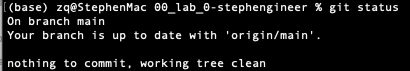

</br>

### Edit the README.md

1. Enter your name in the README.md and save it.
2. `$ git status` again.

After you run `$ git status` again, you will see that git has kept track of our changes. This time, it says that the file `README.md` has changed, but the `changes is not staged for commit`.

</br>

### Git workflow

As usual, one picture is worth a thousand words:


</br>

You go from zone to zone by the [git commands](https://git-scm.com/docs).

```sh
# show the working tree status
$ git status

# to see differences
$ git diff

# to stage all different files
$ git add .

# record changes to the repository
$ git commit -m "comments of changes"

# update code to remote repo
$ git push origin master

# show commit logs
$ git log
```

</br>

Now, Github knows about your changes, take a look at your project repo on Github to see how the changes you made to README.md.

__Note__: `commit` and `push` often: make sure you `commit` your changes after completion of __every__ task. Remeber, `commit`s are the record of your progress. You will be graded on your commits and push your changes frequently.

</br>

### Bonus

- Try to learn git [branches](https://www.atlassian.com/git/tutorials/using-branches).

---

</br>

<a name="getting_started"></a>

## Getting started

</br>

### Step 1: Find <a href="./basic_test.cpp" target="_blank">`basic_test.cpp`</a>

You will be supplied with a <a href="./basic_test.cpp" target="_blank">`basic_test.cpp`</a> file. You will copy this file and overwrite the existing _generic_ `basic_test.cpp` in your project folder. After this, you will __NEVER__ edit the `basic_test.cpp` file.

<a href="./basic_test.cpp" target="_blank">`basic_test.cpp`</a> demonstrates the functionality of the project and gives you an opportunity to make sure your function signatures and class declarations match those of the grader.
You should be able to compile and run the `basic_test.cpp` with your functions.

Pay special attention to the `#include` path at the top. Your file structure has to be __exactly__ the same as the one depicted here.

###### click <a href="./basic_test.cpp" target="_blank">here</a> to download basic_test.cpp if you have not already

<br>

### Step 2: Create project folder

Create a new function folder under the `includes/` folder and name this folder to `array_functions`. This is the directory you will add your `.h` and `.cpp` files.

<br>

### Step 3: Add two project files

Add two files in the project folder:

- `array_functions.h`
- `array_functions.cpp`

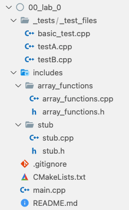

</br>

### Step 4: Add the function signatures

Add these function signatures to the `array_functions.h`

```c++
#ifndef ARRAY_FUNCTIONS_H
#define ARRAY_FUNCTIONS_H

#include <iostream>
#include <iomanip>
#include <cassert>

using namespace std;

//initialize the first size elements of the array
void _array_init(int a[], int size, int x=0);
//add append_me to the end of the array and size++
void _append(int a[], int& size, int append_me);
//return index of find_me -1 if not found
int _find(const int a[], int size, int find_me);
//return item at index pos
int& _at(int a[], int size, int pos);
//print the array
void _print_array(const int a[], int size);

#endif // ARRAY_FUNCTIONS_H
```

Normally, you will either be given these function signatures or you will _deduce_ them from the code in `basic_test.cpp`

</br>

#### Tips

I normally copy the function signatures and paste them into the `.cpp` file. Then, I replace the `;` at the end of the line with braces (`{}`). Then, I add the returns whenever necessary.

__Note__: removing the default value of x in `_array_init`

```c++
#include "array_functions.h"

void _array_init(int a[], int size, int x) {

}

void _append(int a[], int &size, int append_me) {

}

int _find(const int a[], int size, int find_me) {
    return 0;
}

int& _at(int a[], int size, int pos) {
    return a[0];
}

void _print_array(const int a[], int size) {
    cout << endl;
}
```
</br>

### Step 5: Open terminal

If you are using VSCode, you can open the terminal by pressing [`ctrl`]+[`]

[`] is the key in the top left of the keyboard

Using the terminal in this way is very convenient.

</br>

### Step 6: Build project

#### Install cmake tools

An easy method to build project. If you have not already install CMake and CMake Tools in VS Code:

1. On the left of VS Code, click on `extensions`.
1. Search `cmake`.
1. Install `CMake` and `CMake Tools`

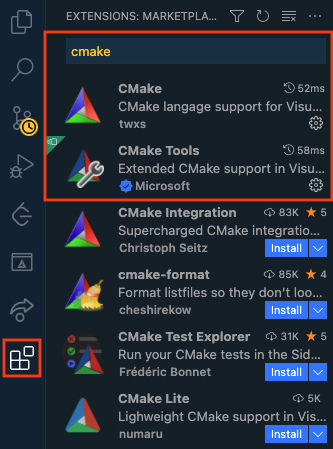

</br>

#### Rebuild
You should be able to right click on `CMakeLists.txt` and click on `Clean Reconfigure All Projects`:

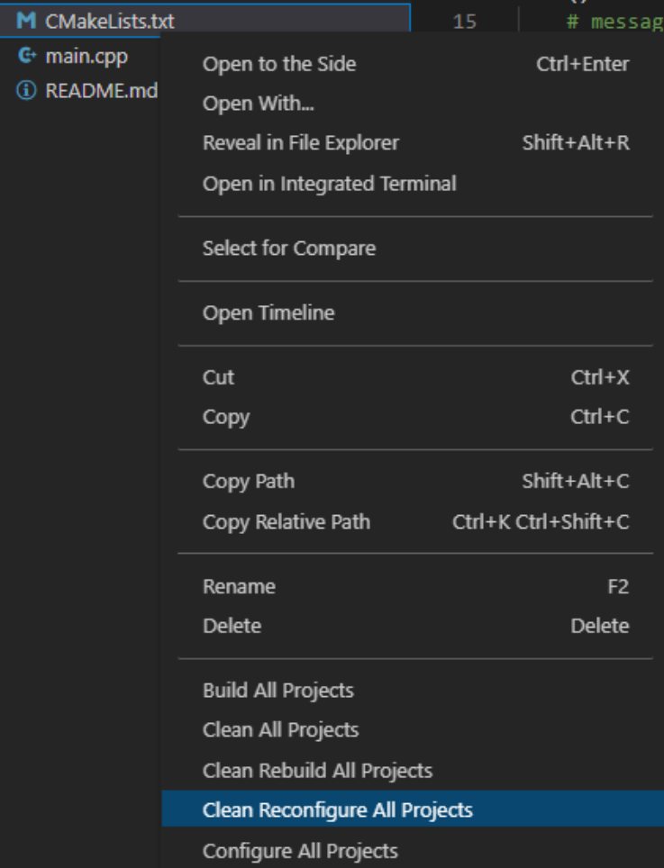

</br>

A prompt should appear on top, just click on similar compiler to:

- Mac: `Clang 13.0.0`
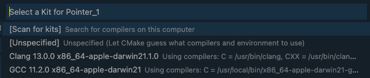

- Windows: `GCC 6.3.0 mingw`
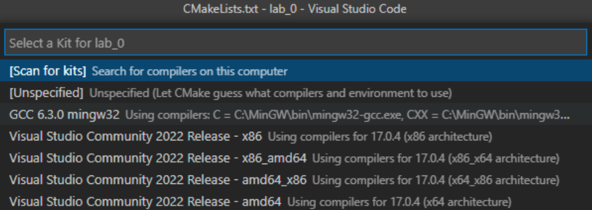

</br>

If it does not show up, you will need to manually select it on the bottom there is a button as shown:


</br>

- If it does not show `GCC 6.3.0 mingw32` click on that button and select it.
- If there is no option, try scanning for kits and try again.
- If it still doesn’t show up, you probably messed up your Mingw installation.

The output should look something like this:

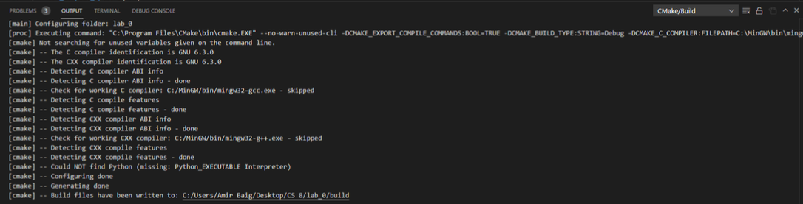

</br>

Some buttons should be on the bottom:

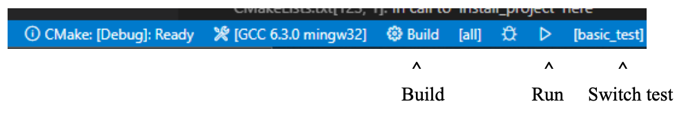

</br>

__Note__: With every future project, just `Clean Reconfigure All Projects` and everything should be more or less the same. __If there are any errors, just delete the build folder and retry__.

</br>

### Step 7: Compile project

Now, we are ready to compile project by clicking on **Run** (triangle) button.

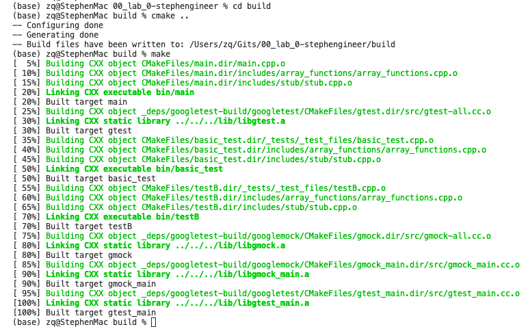

</br>

### Step 8: Push changes to Github

Run git commands to commit changes:

```sh
$ git status
$ git add .
$ git commit - m "success on make with stubs"
```

__Note__: The importance of having __regular__ `commit`s in your project cannot be overstated. This is a large part of the evaluation of your project by me.

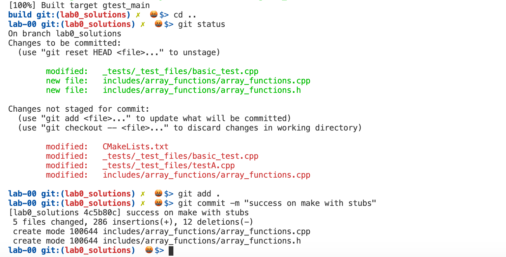

</br>

Now, you can implement functions one by one in `array_functions.cpp` and write tests in the `testB.cpp` file for it to complete the project.

---

</br>

<a name="completing_the_project"></a>

## Completing the project

</br>

### Writing tests

After implementing the `_array_init` and `_print_array` functions, we will write a simple test that will verify the function works as it should.

The test function is boolean. It returns `true` if the init function works properly and false otherwise.

Call the `_array_init` function and then go through each and every cell and verify that each element is -1. If you find one cell that is not -1, return false.

Note also that we return `true` at the end of the test function. I do this in every test function I write.

```c++
bool test_init_array(bool debug=false) {
  int a[20];
  int size = 5;
  const char tabs[] = "\t--------------------------\t";
  if (debug) {
    cout << tabs << "size: 5, init array to -1" << endl;
  }
  _array_init(a, size, -1);
  if (debug) {
    cout << tabs;
    _print_array(a, size);
    cout << endl;
  }
  for (int i=0; i<size; i++) {
    if (a[i] != -1) {
      cout << "FAILED: Expected -1 at a[" << i << "], but found: " << a[i] << endl;
      return false;
    }
  }
  return true;
}
```

</br>

### The `TEST`

The `TEST` function is part of the google test testing framework. To simplify our work, we always use the same format for the `TEST` function: Declare a `bool success` and assign it to the return value of the test function.

Then, compare `success` with `1` or `true`

A quick word about the two arguments of the `TEST` function:

- test suit
- test name

The first is the name of the _test suit_ and the second is the name of this very test. Each test suit may contain multiple tests. Later, we will write another test for the `_append` function with the same first argument as this test: `TEST_ARRAY`. By the time we are done, the `TEST_ARRAY` test suite will have three individual tests.

Pay attention to the _naming conventions_ for this course:

- __test suite__ will be in __ALL uppercase__ with underscores between the words.
- __test names__ will be in __camel case__.
- __test function names__ will be in __ALL lowercase__ with underscores between the words.

```c++
//Lord help me! 
const bool debug = false;

TEST(TEST_ARRAY, TestInit) {
  bool success = test_init_array(debug);
  EXPECT_EQ(success, true);
}
```

</br>

### make and run

This time, we will run `make` successfully and then, we run the `testB` executable by typing `./bin/testB`

This means execute the file named `testB` that is located in the `bin` folder which is under the `current folder`. The bin folder is created by `make`

remember that `.` means current folder and is not optional. You __must__ include the dot in the call to execute `testB`

This will display two successful test runs: one for the `stub` test that was already part of the project, and one for the `TestInit` that we just wrote.

This means that our test function returned `true`.

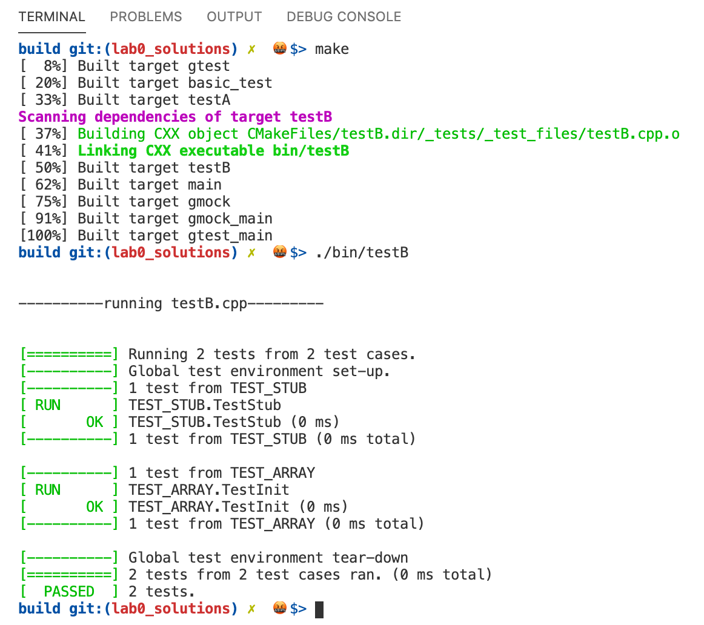

---

</br>

### Implement all functions

Let's implement all other functions in `array_functions.cpp`:

```c++
void _append(int a[], int& size, int append_me) {
  a[size++] = append_me;
}

int _find(const int a[], int size, int find_me) {
  // Implement the _find() function on your own
}

int& _at(int a[], int size, int pos) {
    assert(pos<size);
    return a[pos];
}
```

### Writing all tests

Let's write all other test in `testB.cpp`:

```c++
bool test_append(bool debug=false) {
  int a[20];
  int size = 5;
  const char tabs[] = "\t--------------------------\t";
  if (debug) {
    cout << tabs << "size: 5, init array to -1" << endl;
  }
  _array_init(a, size, -1);
  if (debug) {
    cout << tabs;
    _print_array(a, size);
    cout << endl;
  }
  for (int i = size; i < 10; i++) {
    _append(a, size, i * 10);
    if (debug) {
      cout << tabs;
      _print_array(a, size);
      cout << endl;
    }
  }
  if (size != 10) {
    cout << "FAILED: Expected size to be 10, but found: " << size << endl;
    return false;
  }
  if (a[size-1] != (size-1)*10) {
    cout << "FAILED: Expected: " << (size-1)*10 
         << " at a[" << size-1 << "], but found: " << a[size-1] << endl;
    return false;
  }
  return true;
}

bool test_at(bool debug=false) {
  int a[20];
  int size = 5;
  const char tabs[] = "\t--------------------------\t";
  if (debug) {
    cout << tabs << "size: 5, init array to -1" << endl;
  }
  _array_init(a, size, -1);
  if (debug) {
    cout << tabs;
    _print_array(a, size);
    cout << endl;
  }
  int at_i;
  for (int i=0; i<size; i++) {
    at_i = _at(a, size, i);
    if (at_i != -1) {
      cout << "FAILED: Expected at{i} to return -1, but found: " << at_i << endl;
      return false;
    }
  }
  _at(a, size, 3) = 300;
  at_i = _at(a, size, 3);
  if (at_i != 300) {
    cout << "FAILED: Expected to find 300 at{3}, but found: " << at_i << endl;
    return false;
  }
  return true;
}

bool test_find(bool debug=false) {
  // Implement the _find() test function on your own
}
```

Obviously, you are done in the testB.cpp file, do not forget to add the `TEST()`  for all test functions.

Let's `make` and run `testB` to make sure all test functions pass.

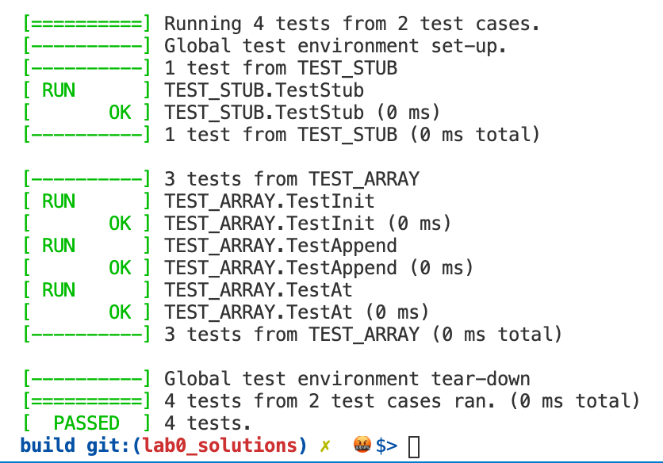

</br>

Once you have successfully run `testB`, you can run git commands to commit changes:

```sh
# under project folder: ./00_lab_0

$ git status
$ git add .
$ git commit -m "success on test with stubs"
$ git push origin master
```

</br>

### Run `basic_test.cpp`:

Now that we have implemented all the functions that are used in `basic_test.cpp`, we can `make` and run this file.

I cannot overemphasize how important it is for this test to be able to compile and run __without__ your editing it in any way. If your project cannot compile and run `basic_test`, the grader will not be able to run your project.

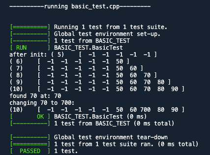

</br>
