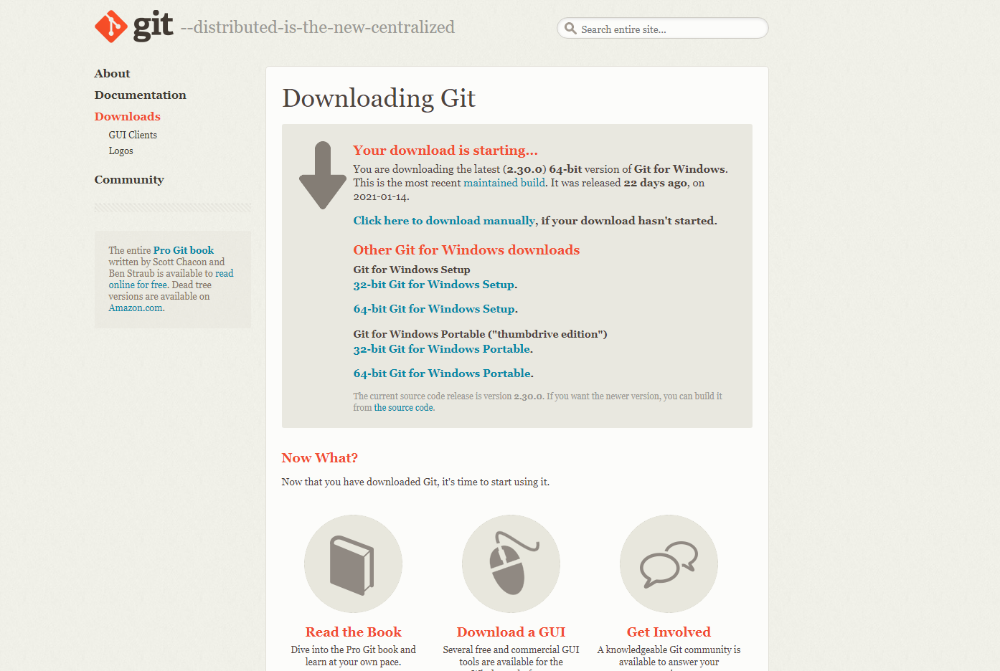
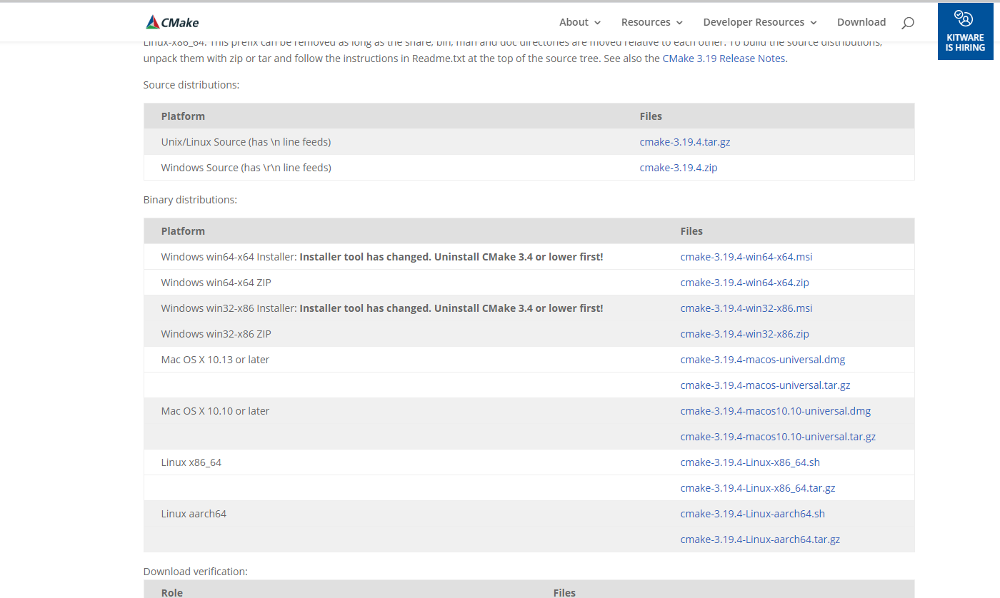
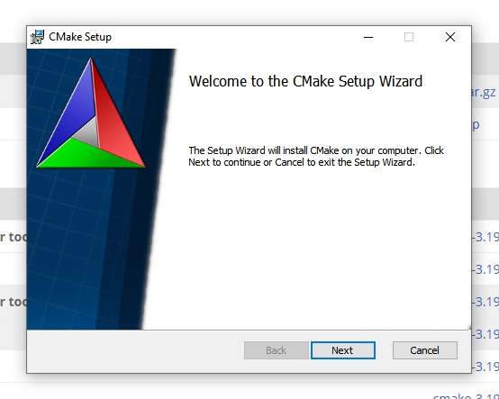
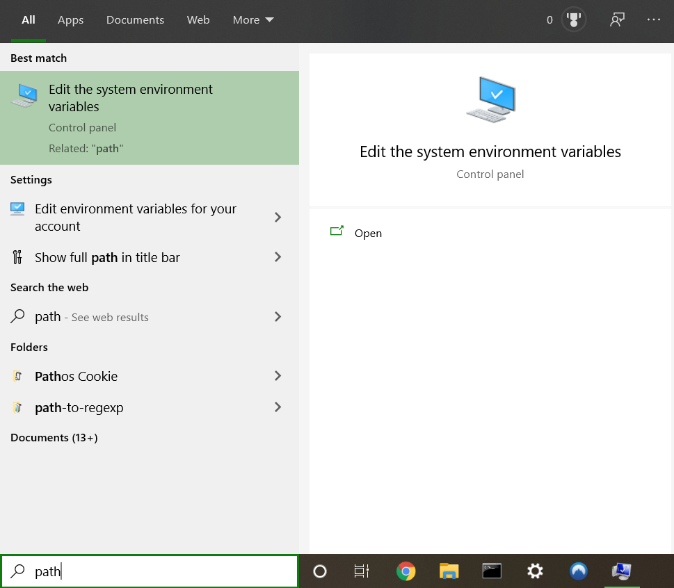
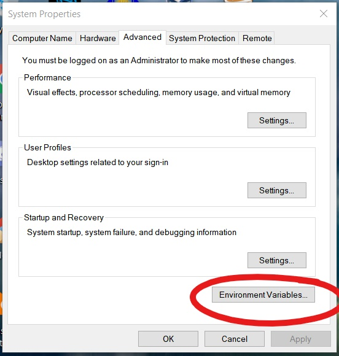
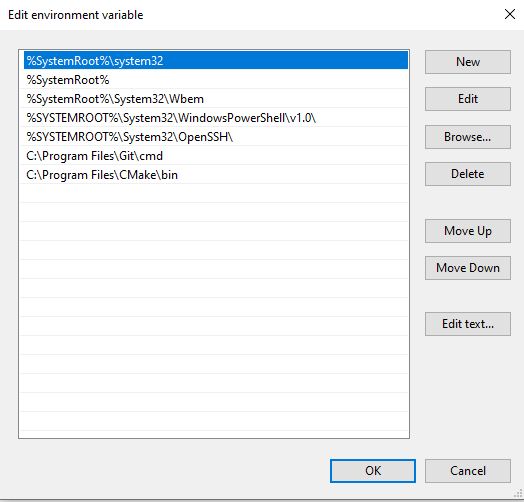

# Windows Instructions</br>

- ### [Installing `git`](#win_installing_git)</br>
- ### [Installing `cmake`](#win_installing_cmake)</br>
- ### [Installing `MinGW`](#win_installing_mingw)</br>

---

</br>

<a name="win_installing_git"></a>

## Installing git

</br>

### Download `git`

Download git from [here](https://git-scm.com/download/win). You should get an exe similar to this: `Git-2.30.0.2-64-bit.exe`



</br>

### Install `git`

Open/run the executable, and follow the steps to install. You can safely stick with the default options for everything to Install!

</br>

### Check git installation

To make sure git is installed correctly

```sh 
$ git --version
```


<br/>

### Login git

Login git with username and email address:

```sh
$ git config --global user.name "stephengineer"
$ git config --global user.email swang03@pasadena.edu
```

---

</br>

<a name="win_installing_cmake"></a>

## Installing cmake

</br>

### Download `cmake`

Download cmake from [here](https://cmake.org/download/). Choose the Windows win64-x64 Installer. You should get an msi with a name similar to this: `cmake-3.19.4-win64-x64.msi`



</br>

### Install `cmake`

Open/Run the executable file, and follow the steps to install.



</br>

Check I accept the terms in the License Agreement.


</br>

**Make sure** to select Add CMake to the system PATH for all users. You can create a Desktop icon if you want, but you will not need to use it for this class.


</br>

The default install location should be C:\Program Files\CMake\

> 

</br>

Install!


</br>

When it is done installing, click Finish.


</br>

### Check the version of the git again:

Let's check to see if `cmake` is installed successfully:

```sh
$ cmake --version
```


---

</br>

<a name="win_installing_mingw"></a>

## Install MinGW

</br>

### Is `MinGW` installed?

Let's check to see if `g++` is installed on your system:

```sh
$ g++ --version
```

If you do not get a response similar to this, then you do not have `g++` and/or `MinGW` on your system and you have to install it.


</br>

### Download `MinGW`

Download cmake from [here](https://sourceforge.net/projects/mingw/files/). You should get an exe named similar to this: `mingw-get-setup.exe`

</br>

### Install `MinGW`/`g++`

Open/Run the executable file, and follow the steps to install.


</br>

The default Installation location should be `C:/MinGW`. Once again, you can add a Desktop shortcut, but it will not be necessary for this class.


</br>

If you get a warning that MinGW is already installed, you can either reinstall and continue with this walk through or choose `Run Now` and skip to the steps below with the MinGW Install Manager.


</br>

Installing...


</br>

When it is done installing, click Continue.


</br>

The **MinGW Installation Manager** should be opened up automatically. For this class, you will need mingw32-base, mingw-gcc-g++, and mingw23-gcc-objc.


</br>

To select a package for installation, right click on it in the menu and select Mark for Installation.


</br>

Marked packages will be selected like this:


</br>

You **also** need to select the pthreads package from under <br/>
All Packages -> MinGW Libraries


</br>

Once all necessary packages have been marked, go to Installations > Apply Changes to install.


</br>

Click Apply


</br>

Once the changes are applied you may close the Installation Manager.


</br>

### Add g++ as a System Variable and to your path

Search for "path" in the task bar search box. Open Edit the system environment variables.



</br>

Click on "Environment Variables..."



</br>

Add the path to the gcc and g++ executables to environment variables as shown below and press OK.


</br>

Next, double click on the **user variable** Path (in the top half of the window). A window like this should pop up:



</br>

Click New, and enter `C:\MinGW\bin` to the text box. Click OK.


</br>

Your environment and user variables should look like this after you are done:


</br>

### Check the version of the g++ again:

To make sure `MinGW`/`g++` is installed correctly, if the version output doesn't show, reboot your machine and try again.

```sh
$ g++ --version
```


---

Once everything is installed, you can move on to the [next step](start_project.md)
